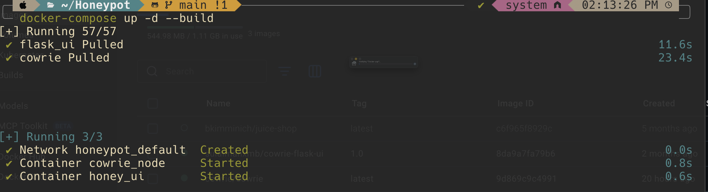
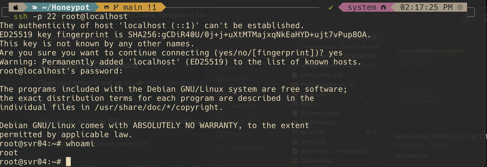
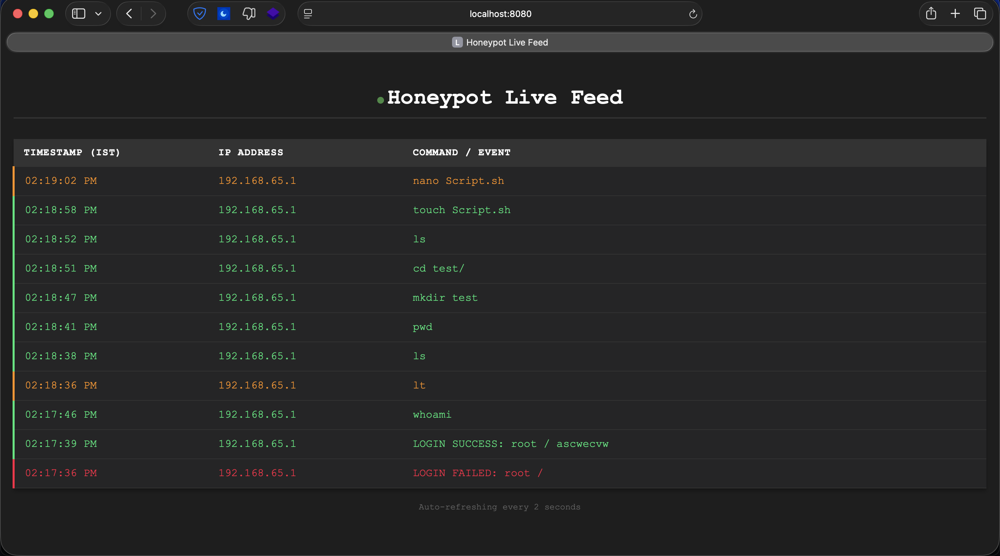

# Cowrie Honeypot with Live Web Dashboard

This is a cowrie SSH honeypot dockerized which has live updating web dashboard running on port 8080

### Note : 
- SSH only works if both devices are in same LAN
- The flask_ui directory is just for reference as the used docker image is directly taken from my dockerhub repo

## Prerequisites
- **Docker** and **Docker Compose** installed on your machine.

-----
## Setup :

### 1. Clone the Repository
```bash
git clone https://github.com/sulaimanxmb/Honeypot
cd Honeypot
```

### 2. Prepare Log Directory
Create the folder where logs will be stored and set the necessary permissions. This is critical because the honeypot container runs as a non-root user.

```bash
mkdir -p cowrie-logs
touch cowrie-logs/cowrie.json
chmod -R 777 cowrie-logs
```

### 3. Start the Application
Build and start the containers(Cowrie Honeypot + Flask UI):

```bash
docker-compose up -d --build
```



### 4. Test It
Simulate an attack by SSH into the honeypot (port 22):

```bash
ssh -p 22 root@container-IP
```
*   **Password:** Any password will likely work (or fail depending on emulation).



### 5. Access the Dashboard
Open your browser and go to :
👉 **http://localhost:8080**



*   **Check the Dashboard:** You should see the login attempt and commands appear immediately.
    *   **Green:** Successful logins and common commands (ls, pwd, etc.).
    *   **Red:** Failed logins.
    *   **Orange:** Unknown commands or typos.

## Stopping the Honeypot: 
To stop the containers:
```bash
docker-compose down
```
